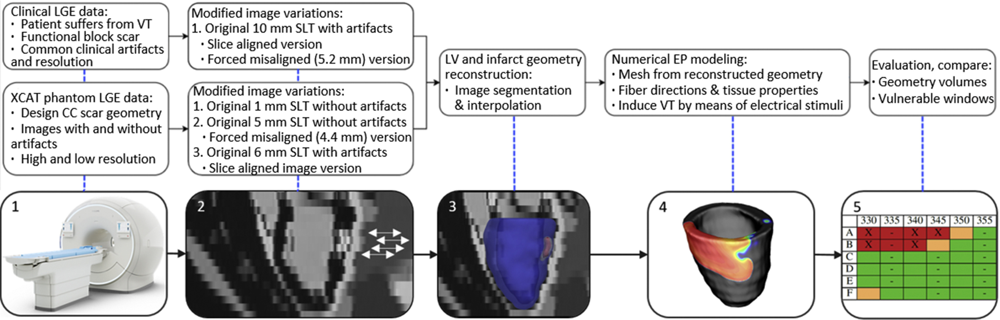
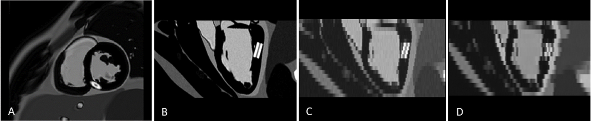

## [Paper](https://www.sciencedirect.com/science/article/pii/S0010482521005679) Influence of image artifacts on image-based computer simulations of the cardiac electrophysiology

#### E. Kruithof, S. Amirrajab, M.J.M. Cluitmans, K.D. Lau, M. Breeuwer.
----

Graphical Abstract
 Five successive steps, starting from a MR LGE image, to assess VT s by EP modeling. Step 1: Create LGE MR images. Step 2: Use slice translations to correct for or induce slice misalignments. Step 3: Reconstruct LV and infarct geometry from the (modified) LGE image. Step 4: Create numerical EP model and attempt to induce VT. Step 5: Use simulation results to examine VT risk and slice misalignment effects.

----
LGE cardiac MR image simulation code for generating data with slice misalignment  artifact. The code is an extension on the initial implementation of the [MRXCAT](https://jcmr-online.biomedcentral.com/articles/10.1186/s12968-014-0063-3) MATLAB code (available [here](https://biomed.ee.ethz.ch/mrxcat.html)) for simulating LGE cardiac MRI with slice misalignment artifacts

## Installation
Clone this repo:
```bash
git clone https://github.com/sinaamirrajab/LGE_CMRI_Simulation
cd LGE_CMR_Simulation/
```
This code was tested on MATLAB 2018b. To produce the results in the paper, you would need to have the XCAT .bin subject for simulation. The .bin files for this study could be provided upon request. 
Note that the XCAT is a separate software which offers computerized human anatomical models for simulation. The XCAT software is available [here](https://olv.duke.edu/industry-investors/available-technologies/xcat/)

Alternatively, Nifti format of the simulated images for different respiratory phases is available at [Results](./Results) folder. This data is combined to mimic slice misalignment artifact [Image3](./Results/Image3.nii.gz) - note that you need to open .nii.gz file with a medical image viewer. [Image1](./Results/Image2.nii.gz) and [Image2](./Results/Image2.nii.gz) are simulations for high and low resolutions, respectievly. 

 SA view of simulated M2D SA LGE MR image with enhanced scar located around right coronary artery. LA view of B) 1 mm SLT and C) 5 mm SLT simulated LGE image without respiratory and D) 6 mm SLT image with respiratory artifacts.


### Citation
If you use this code for your research, please cite our paper.
```
@article{kruithof2021influence,
  title={Influence of image artifacts on image-based computer simulations of the cardiac electrophysiology},
  author={Kruithof, E and Amirrajab, Sina and Cluitmans, MJM and Lau, KD and Breeuwer, Marcel},
  journal={Computers in Biology and Medicine},
  volume={137},
  pages={104773},
  year={2021},
  publisher={Elsevier}
}
```

[](https://doi.org/10.5281/zenodo.5702423)


### License
[openGTN](http://opengtn.eu) simulated / synthetic MRI data by EU Marie Curie ITN-EID program (project 764465) is licensed under a Creative Commons Attribution-NonCommercial-NoDerivatives 4.0 International License available at [CC](https://creativecommons.org/licenses/by-nc-nd/4.0/).
